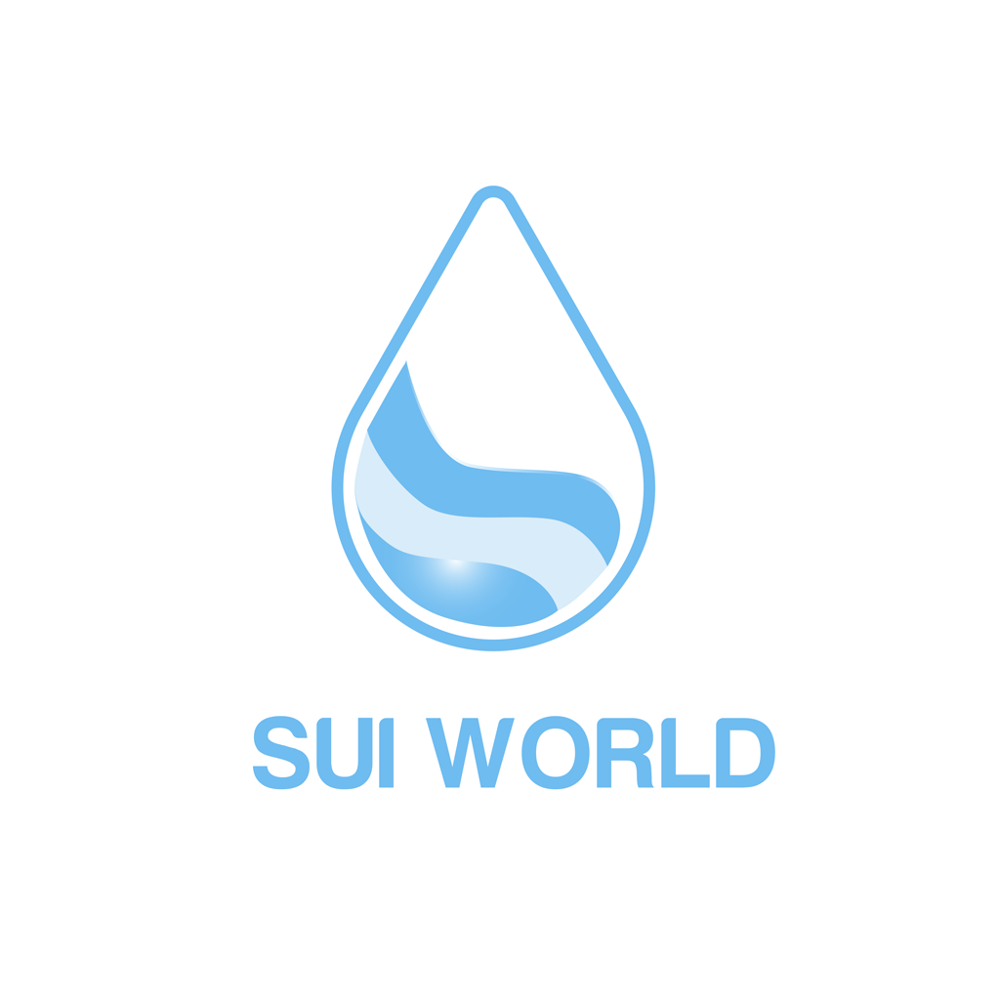

## 这里是Sui World Community

### 亚太首家专注于Move开发者服务、资讯教育的SUI 生态服务机构

作为SUI 生态的桥梁，我们致力于：

To developers: 提供Move开发学习资源、组织黑客松赛事、聚合SUI开发者社区及生态资源，帮助开发者快速学习Move语言

To users：提供SUI全方位科普（SUI特性与生态项目），用通俗的语言帮助用户形成快速认知，让更多人使用SUI网络

To investors：提供SUI最新资讯和投研报告，用系统的信息，帮助投资者得出精确判断。

<!--
**SuiWorld/suiworld** is a ✨ _special_ ✨ repository because its `README.md` (this file) appears on your GitHub profile.

Here are some ideas to get you started:

- 🔭 I’m currently working on ...
- 🌱 I’m currently learning ...
- 👯 I’m looking to collaborate on ...
- 🤔 I’m looking for help with ...
- 💬 Ask me about ...
- 📫 How to reach me: ...
- 😄 Pronouns: ...
- ⚡ Fun fact: ...
-->
